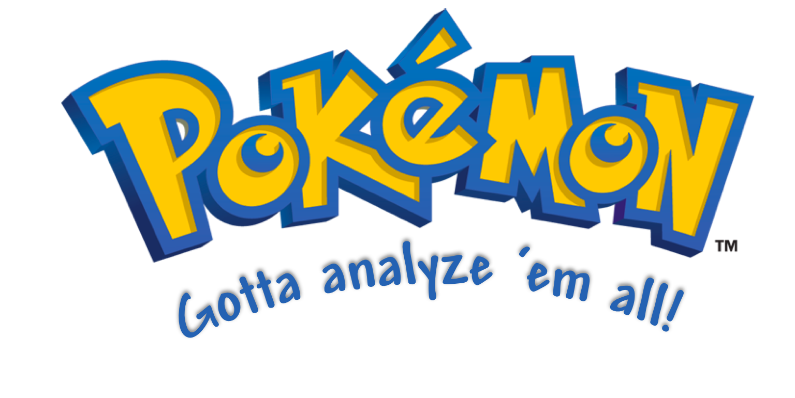

# PokeData


# Table of Contents
- [Description](#description)
- [Motivation](#motivation)
- [Installation](#installation)
- [Files included in this project](#files-included-in-this-project)
- [Running the test](#running-the-test)
- [Team members](#team-members)

# Description 
A Pokedex visual created with the help of R, HTML, and CSS. Learn all about your favorite pokemon through our amazing pokedex.
A Pokedex is an electronic device that summarizes and provides information about the different species of Pokemon. The Pokedex provides information about the stats and location of each pokemon. It also displays various graphs (bar graph, pie chart, scatterplot, line graph, histogram, and stacked bar chart) about the pokemon's information, which are used to help our target group to better learn about different graphs.  

# Motivation
Unfortunately, only 11% of students are able to accurately read and label graphs and charts by the time they get to high school. This is due to the fact that many young students are not engaged when learning about bar charts or graphs and do not retain the information when they are young. However, we believe that learning should be fun, so we created this pokedex for kids and teachers who want to learn and teach about different types of graphs in an enjoyable and interactive way. The graphs that are displayed in the pokedex present various in-depth information about Pokemons that are engaging for kids. 

# Installation
#### Before beginning your pokemon journey you must install these packages if not yet installed

* `shiny` package
  * Creates interactive web application with R
* `httr` package
  * Retrieve data from APIs in R 
  * Most important http verbs: PATCH(),HEAD(), PUT(), POST(), GET() and DELETE()
* `jsonlite` package
  * powerful for implementing pipelines and interacting with a web API
* `plotly` package
  * Builds interactive web-based graph
* `dplyr` package
  * Implements a set of tools for easily and quickly shaping datasets in R
* `ggplot2` package
  * A structure for implementing graphics, based on "The Grammar of Graphics"
* `scales` package
  * Scales map data to aesthetics, and implement labels and breaks for axes and legends
* `Rcurl` package
  * Conviniently fetches URIs
* `audio` package
  * Implements recording and playback of audio
* `seewave` package 
  * Evaluates, shapes, displaying, exhibits and synthesizes time waves such as sound.
* `Rtts` package
  * Converts text into speech
* `splitsstackshape` package
  * Divides concatenated data, manipulates data into different shapes, and stacks columns of datasets


# Files included in this project
    server. R       ggrader.R                   style.css           route_by_name_png_extractor.py          back_logo.png           pokemon_to_route_name.txt 
    global.R        GenerationAverages.R        input.css           map_gif_extractor.py                    banner.png              PokemonGB.woff
    graphs.R        APITools.R                  index.html          route_png_extractor.py                  PokedexBackground.png   PokemonGB.woff2 
    gen1data.csv    gen3data.csv                gen5data.csv        weight_and_height.csv                   type_averages.csv       color.csv 
    gen2data.csv    gen4data.csv                gen6data.csv        pokemon_to_route_name.csv               no_map_poke.csv         pokenames.csv 
    PokemonGB.tff
 


# Running the test
#### Delivers the information of the Sprite of the desired pokemon. If the input name for the pokemon is not found, an error image appears in the Pokedex

 ```
output$image <- renderImage({
  pokemon.df <- pokemon.df()
  if(is.null(pokemon.df$id)){
    image <- "error"
  } else {
    image <- pokemon.df$id
  }
```

#### Queries the pokemon API
```
pokemon.df <- reactive({
  if(input$pokemon == "") {
    pokemon <- "not found"
  } else {
    pokemon <- input$pokemon
  }
    pokemon.df <- QueryApi(paste0("pokemon/", tolower(pokemon)))    
})
```

 # Team members
* [Akash Srinagesh](https://github.com/asrinagesh)
* [Charlie Mihran](https://github.com/cmihran)
* [Tu Nguyen](https://github.com/nguyet04)
* [Momomi Lam](https://github.com/momomilam)